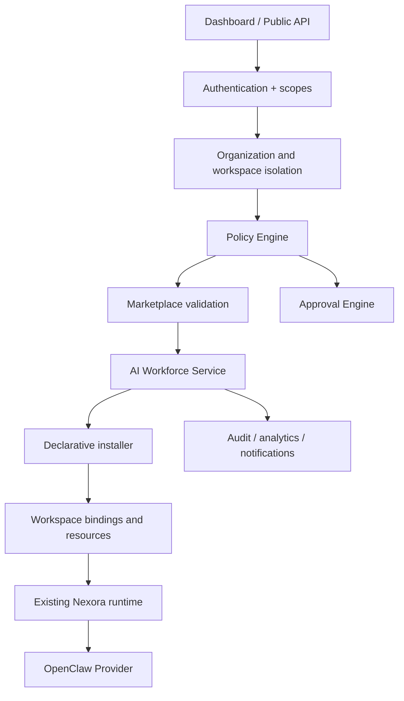
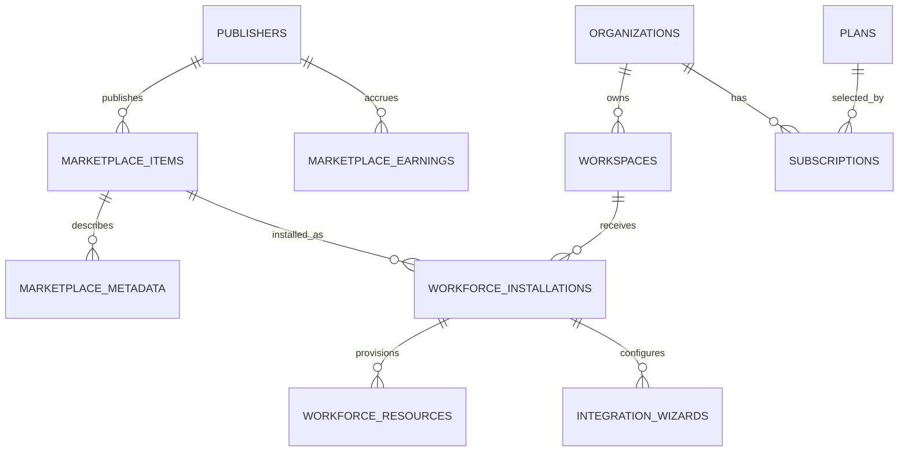

# Nexora 4.0 Architecture

## Request flow

The browser never accesses OpenClaw, SQLite, secrets, or tools directly. AI
employees are bundles of existing Marketplace entities and declarative
workspace resources rather than executable plugins.

## Entity relationship diagram

`marketplace_metadata` adds presentation, compatibility, pricing, visibility,
auto-update preference, and documentation fields without changing the legacy
Marketplace table. `workforce_resources` stores only declarative resource
payloads. Protected credential values remain in the existing secret store.

## Compatibility

- Existing Marketplace `AGENT`, `SKILL`, and `TEMPLATE` IDs are unchanged.
- Existing task/runtime, Agent Registry, Skills, Billing, Memory, RBAC, and
  approval APIs are unchanged.
- Migration 013 is additive and reversible.
- No Gateway, firewall, port, secret, or production authentication change is
  required.
